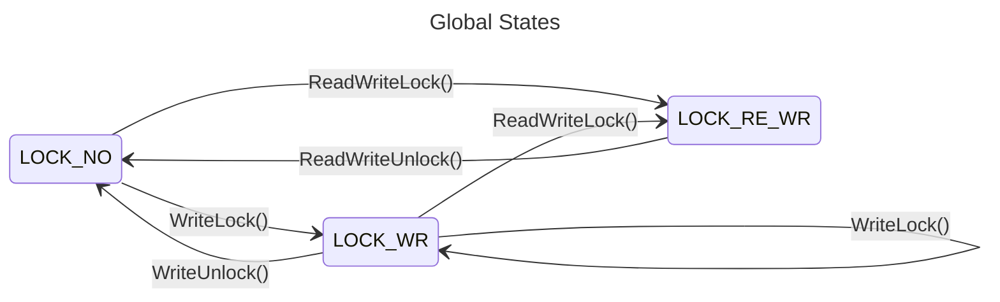
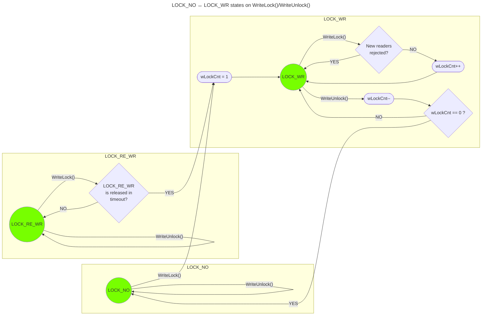
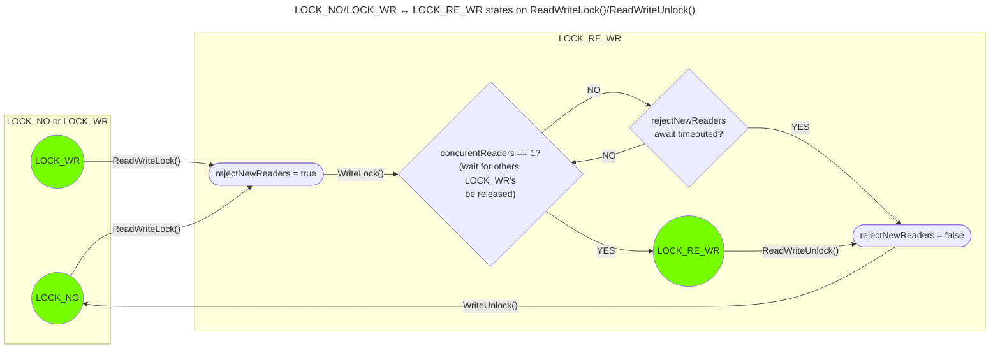

# RWLock (Shared Mutex)

## General

- LOCK_NO (unlocked): processes can write/read data to/from resource (data consistency warning)
- LOCK_WR (write lock): multiple processes can read data from resource, but not write (same as mux.RLock() in golang)
- LOCK_RE_WR (read/write lock): processes can do nothing with resource (full lock)

The most simplified scheme of the rw mutex relation is as follows:



---

## Additional Info

- Creating a Linked List involves externally passing two functions - counter and delay (bare-metal or RTOS)
- These functions can be empty - then blocking will always be successful

```c
// Example for LinkedList with intergrated RWLock
LinkedList_Handle_t LightWaves_Handle;

//No any access restrictions
LinkedList_Create(&LightWaves_Handle, NULL, NULL);

//RTOS example
LinkedList_Create(&LightWaves_Handle, xTaskGetTickCount, vTaskDelay);

//Bare-metal example
LinkedList_Create(&LightWaves_Handle, Delay_TimeMilliSec_Get, Delay_WaitTime_MilliSec);
```

- When use with RTOS functions, you can not use locks inside critical sections. If a resource is locked and the vTaskDelay wait function is running, the program will hang in an infinite loop
- If the Linked List is used before the start of the OS scheduler and there are no errors in the user code, there will be no locks in a single-threaded environment and the vTaskDelay() function will not be called at all

## Write Lock

- Setting the LOCK_WR state prohibits actions that modify the resource
- The resource becomes read-only, and it can be read by several processes at the same time
- Each reader performs WriteLock() locking, retrieves the necessary data and returns possession of the resource by calling WriteUnlock()
- To control access of different processes, locks and unlocks within the resource are counted; a zero count means that all processes have released possession of the resource
- The LOCK_RE_WR state is a fully locking state and WriteLock() will wait for a timeout until the read and write protection is lifted
- A state change request LOCK_WR -> LOCK_RE_WR blocks new read subscribers by setting the RejectNewReaders flag



### WriteLock example

- Only read operations allowed
- Insert/extract (and other modification) operations will be rejected (RET_STATE_ERR_BUSY state will be returned)

```c
typedef struct 
{
    char Color[16];
    u32 WaveLen;
} LightWave_t;

LinkedList_Handle_t LightWaves_Handle;

u32 GetColorWaveLen(char* pColor)
{
    u32 waveLen = 0;

    RET_STATE_t wLockState = LinkedList_WriteLock(&LightWaves_Handle, 100);
    if(rwLockState != RET_STATE_SUCCESS)
    {
        LOCAL_DEBUG_PRINT("linkedList wLock isn't ready in '%s'!", __FUNCTION__);
        return waveLen;
    }

    u32 nodesNum = LinkedList_GetNodesNum(&LightWaves_Handle);
    for(u32 llIdx = 0; llIdx < nodesNum; llIdx++)
    {
        //Use const pointer in case of read-only ops within cycle context
        const LightWave_t* pNode = NULL;
        LinkedList_GetDataPtr(&LightWaves_Handle, (void**)&pNode, NULL, llIdx);
        
        if(!strncmp(pNode->Color, pColor, sizeof(pNode->Color)))
        {
            waveLen = pNode->WaveLen;
            break;
        }
    }

    LinkedList_WriteUnlock(&LightWaves_Handle);
    return waveLen;
}
```

---

## Read/Write Lock

- Setting the LOCK_RE_WR state is a complete locking of the resource, prohibiting any read and write operations
- When setting LOCK_RE_WR lock, the first action is to lock LOCK_WR, and then wait until the number of read subscribers drops to 1 - so, only the current lock remains; once this happens, the LOCK_RE_WR state is set



### ReadWriteLock example

- R/W operations allowed after RWLock
- Insert/extract (and other modification) operations without lockKey will be rejected (RET_STATE_ERR_BUSY state will be returned)
- lockKey implements the concept of a mutex keeper(holder). When locking a linked list, the lockKey is returned to a variable and can be used by functions with the LinkedList_PrivateXXX prefix to access the data despite the lock

```c
typedef struct 
{
    char Color[16];
    u32 WaveLen;
} LightWave_t;

LinkedList_Handle_t LightWaves_Handle;

RET_STATE_t SetColorWaveLen(char* pColor)
{
    u32 waveLen = 0;

    u32 lockKey = 0;
    RET_STATE_t rwLockState = LinkedList_ReadWriteLock(&LightWaves_Handle, 100, &lockKey);
    if(rwLockState != RET_STATE_SUCCESS)
    {
        LOCAL_DEBUG_PRINT("linkedList rwLock isn't ready in '%s'!", __FUNCTION__);
        return rwLockState;
    }

    u32 nodesNum = LinkedList_GetNodesNum(&LightWaves_Handle);

    //Modify data inside the LL
    for(u32 llIdx = 0; llIdx < nodesNum; llIdx++)
    {
        LightWave_t* pNode = NULL;
        LinkedList_GetDataPtr(&LightWaves_Handle, (void**)&pNode, NULL, llIdx);

        if(!strncmp(pNode->Color, pColor, sizeof(pNode->Color)))
        {
            pNode->WaveLen = Color2WaveLen(Color);
            break;
        }
    }

    //Or extract and insert data from/to LL (slower insted of direct modification)
    for(u32 llIdx = 0; llIdx < nodesNum; llIdx++)
    {
        LightWave_t node;
        LinkedList_PrivateExtract(&LightWaves_Handle,
                &node, NULL, llIdx, lockKey);

        if(!strncmp(node.Color, pColor, sizeof(pNode->Color)))
        {
            node.WaveLen = Color2WaveLen(Color);

            LinkedList_PrivateInsert(&LightWaves_Handle,
                    &node, sizeof(LightWave_t), llIdx, lockKey);
            break;
        }

        LinkedList_PrivateInsert(&LightWaves_Handle,
                &node, sizeof(LightWave_t), llIdx, lockKey);
    }

    LinkedList_ReadWriteUnlock(&LightWaves_Handle);
    return RET_STATE_SUCCESS;
}
```

---

## External references

- [Golang Mutexes — What Is RWMutex For?](https://medium.com/bootdotdev/golang-mutexes-what-is-rwmutex-for-5360ab082626)
- [Mutexes and RWMutex in Golang](https://dev.to/cristicurteanu/mutexes-and-rwmutex-in-golang-4ij)
